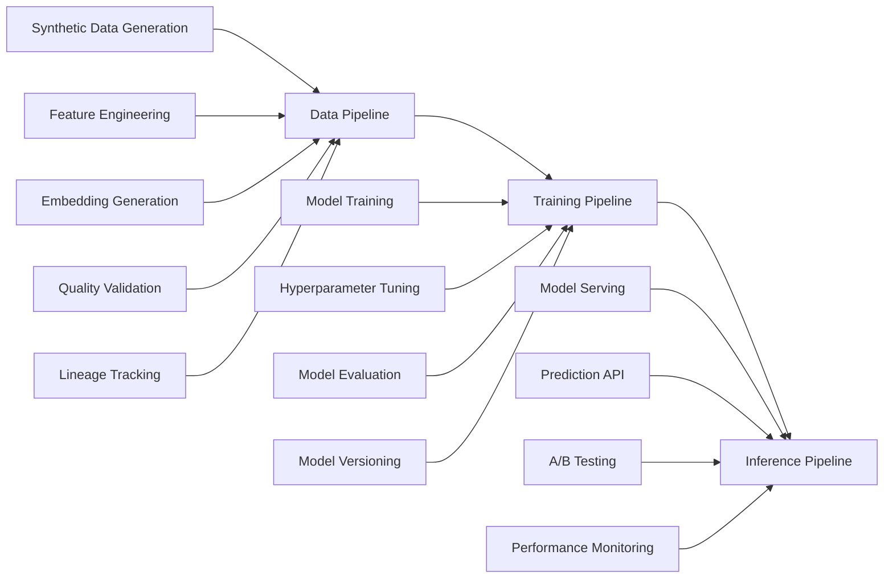
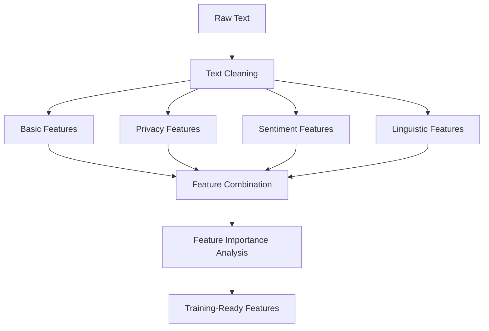
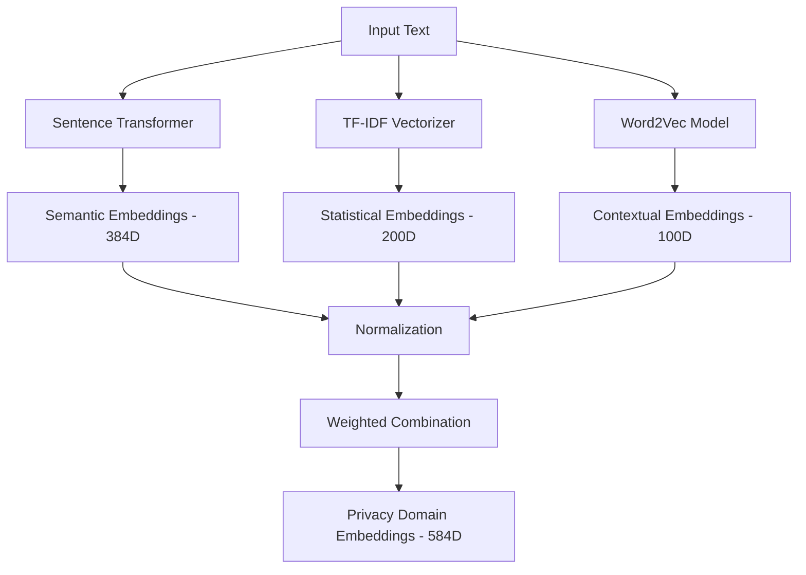
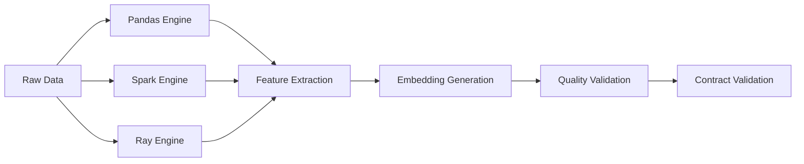
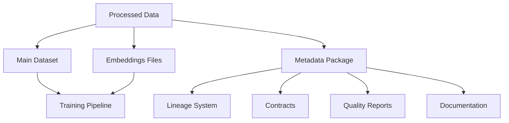

# Enhanced Architecture and Data Flow


## PCC Ecosystem Architecture

The Privacy Case Classifier (PCC) ecosystem follows a **microservices ML architecture** with three specialized pipelines:



### **Pipeline Separation Benefits**
- **Independent Scaling**: Each pipeline scales based on its specific workload
- **Technology Optimization**: Use optimal tech stack for each pipeline's needs
- **Team Ownership**: Different teams can own different pipeline components
- **Deployment Flexibility**: Independent deployment and versioning cycles

## Enhanced Data Pipeline Architecture

### **Core Processing Engines**
The pipeline supports multiple processing engines with automatic selection:

```python
# Engine Selection Logic
if data_size > LARGE_THRESHOLD and SPARK_AVAILABLE:
    engine = SparkEngine()
elif processing_type == ML_INTENSIVE and RAY_AVAILABLE:
    engine = RayEngine()
elif streaming_enabled and BEAM_AVAILABLE:
    engine = BeamEngine()
else:
    engine = PandasEngine()
```

1. **Apache Spark**: 
   - **Use Case**: Large-scale batch processing (>1M records)
   - **Capabilities**: Distributed SQL, MLlib integration, streaming
   - **Auto-scaling**: Dynamic resource allocation

2. **Ray**: 
   - **Use Case**: ML-intensive feature engineering and embedding generation
   - **Capabilities**: Distributed ML, parallel processing, actor model
   - **Optimization**: GPU acceleration for embedding models

3. **Apache Beam**: 
   - **Use Case**: Streaming data processing with exactly-once semantics
   - **Capabilities**: Portable pipelines, multiple runner support
   - **Flexibility**: Cloud Dataflow, Flink, Spark runners

4. **Pandas**: 
   - **Use Case**: Development, small datasets (<100K records)
   - **Capabilities**: Rich data manipulation, fast prototyping
   - **Integration**: Native Python ecosystem

### **Advanced Feature Engineering Pipeline**



**Feature Categories:**
- **Basic Features** (8): Length, word count, punctuation, formatting
- **Privacy Features** (8): Keyword detection, PII patterns, formal language
- **Sentiment Features** (4): VADER sentiment analysis (positive, negative, neutral, compound)
- **Linguistic Features** (6): Readability, vocabulary richness, POS patterns

### **Multi-Modal Embedding Architecture**



**Embedding Strategy:**
- **Sentence Transformers**: Capture semantic meaning for privacy intents
- **TF-IDF + SVD**: Statistical patterns and term importance
- **Weighted Combination**: 70% semantic + 30% statistical for domain optimization

## Enhanced Data Flow

### **Stage 1: Enhanced Data Generation**

```python
class EnhancedSyntheticDataGenerator:
    def generate_dataset(self, n_samples, variation_level):
        # Template-based generation with realistic variations
        # Business-hour temporal patterns
        # Confidence modeling based on text characteristics
        # Metadata enrichment (formality, urgency scores)
```

**Improvements over basic generation:**
- **30+ templates per intent** with realistic variations
- **Temporal realism**: Business hours, weekday bias, seasonal patterns
- **Linguistic diversity**: Formal, informal, urgent, angry variations
- **Confidence modeling**: Text characteristics drive confidence scores

### **Stage 2: Advanced Processing**



**Processing Enhancements:**
- **Automatic engine selection** based on data size and available resources
- **Lineage tracking** for every transformation with dataset fingerprinting
- **Error handling** with graceful degradation and retry mechanisms

### **Stage 3: Enterprise Validation**

```python
class EnterpriseValidation:
    def validate_data(self, df):
        schema_results = self.schema_validator.validate_schema(df)
        quality_results = self.quality_checker.check_quality(df)
        contract_results = self.contracts_manager.validate_training_data(df)
        
        # Complete lineage tracking
        self.lineage_tracker.track_data_quality_metrics(dataset_id, quality_results)
```

**Validation Layers:**
1. **Schema Validation**: Pydantic models with constraints
2. **Quality Checks**: Great Expectations with statistical analysis
3. **Contract Validation**: Downstream pipeline compatibility
4. **Business Rules**: Privacy-specific validation logic

### **Stage 4: Intelligent Sampling**

```python
class AdvancedSampler:
    def sample_data(self, df):
        # Stratified sampling with class balancing
        # SMOTE oversampling for minority classes
        # Advanced sampling statistics
        # Lineage tracking for sampling decisions
```

**Sampling Intelligence:**
- **Stratified sampling** maintains class distribution
- **SMOTE/ADASYN** for handling class imbalance
- **Custom strategies** for privacy intent classification
- **Statistical validation** of sampling quality

### **Stage 5: Enhanced Output Generation**



**Output Enhancements:**
- **Training-ready datasets** with all features and embeddings
- **Separate embedding files** for optimization
- **Complete metadata packages** with lineage and contracts
- **Auto-generated documentation** for downstream teams

## Contract-Driven Integration

### **Training Data Contract**
```json
{
  "schema": [
    {"name": "text", "type": "string", "nullable": false},
    {"name": "intent", "type": "string", "constraints": {"allowed_values": [...]}},
    {"name": "embeddings", "type": "array", "dimension": 584},
    {"name": "confidence", "type": "float", "range": [0.0, 1.0]}
  ],
  "quality_requirements": {
    "completeness": 0.99,
    "validity": 0.98,
    "uniqueness": 0.95
  }
}
```

### **Data Lineage Integration**
```python
# Automatic lineage tracking
dataset_id = tracker.track_dataset(df, "processed_data", "feature_engineering")
stage_id = tracker.track_stage("embedding_generation", [input_id], [output_id])
tracker.track_data_quality_metrics(dataset_id, quality_results)
```

## Observability and Monitoring

### **Comprehensive Metrics**
- **Data Quality Scores**: Real-time quality monitoring
- **Processing Performance**: Throughput, latency, resource utilization
- **Feature Engineering**: Coverage, importance, extraction time
- **Embedding Quality**: Statistical measures, similarity distributions

### **Enterprise Dashboards**
- **Grafana**: Real-time pipeline health monitoring
- **MLflow**: Experiment tracking and feature analysis
- **Prometheus**: Metrics collection and alerting

### **Audit and Compliance**
- **Complete lineage**: Every data transformation tracked
- **Quality reports**: Automated generation for compliance
- **Contract validation**: Ensures downstream compatibility
- **Metadata preservation**: Rich context for debugging and analysis

---

This enhanced architecture demonstrates **production-ready ML engineering** with sophisticated feature engineering, complete observability, and enterprise-grade quality assurance.

 