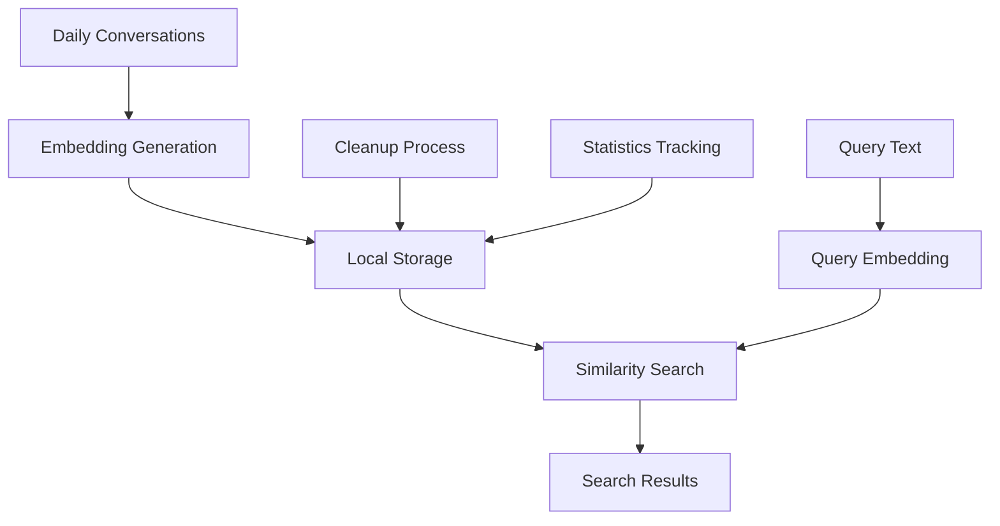

# Local Vector Store

## Overview

The **Local Vector Store** is a built-in component of the PCC Data Pipeline that provides similarity search capabilities for daily conversations without external dependencies or cloud service costs.

## Architecture

### **Core Components**



### **Storage Structure**

```
vector_store/
├── metadata.json          # Store metadata and statistics
└── embeddings.pkl         # Embeddings and conversation data
```

## Features

### **1. Local Storage**
- **File-based storage**: JSON metadata + pickle embeddings
- **Automatic directory creation**: Self-initializing store structure
- **Data persistence**: Survives application restarts
- **Version control**: Timestamped data with metadata

### **2. Similarity Search**
- **Cosine similarity**: Normalized vector comparison
- **Configurable top-k**: Adjustable result count
- **Batch processing**: Efficient search across large datasets
- **Score ranking**: Results sorted by similarity score

### **3. Daily Conversation Management**
- **Template-based generation**: Realistic conversation variations
- **Automatic cleanup**: Configurable retention policies
- **Statistics tracking**: Daily conversation counts and metrics
- **Metadata enrichment**: User IDs, timestamps, session tracking

## Usage

### **Basic Operations**

```python
from src.utils.vector_store import LocalVectorStore
from src.features.embeddings import EmbeddingGenerator

# Initialize components
vector_store = LocalVectorStore("my_vector_store")
embedding_generator = EmbeddingGenerator()

# Add conversations
conversations = [
    {
        'id': 'conv_001',
        'text': 'I need help with my account',
        'timestamp': '2025-07-30T10:00:00',
        'user_id': 'user_1234'
    }
]

# Generate embeddings
texts = [conv['text'] for conv in conversations]
embeddings = embedding_generator.generate_sentence_embeddings(texts)

# Add to vector store
total = vector_store.add_conversations(conversations, embeddings)

# Search similar conversations
query_embedding = embedding_generator.generate_sentence_embeddings(['I need help'])
results = vector_store.search_similar(query_embedding[0], top_k=5)

# Get statistics
stats = vector_store.get_daily_stats()
info = vector_store.get_store_info()
```

### **Daily Pipeline Integration**

```python
from src.daily_conversations_pipeline import DailyConversationsPipeline

# Initialize pipeline
pipeline = DailyConversationsPipeline("config_daily_conversations.yaml")

# Generate daily conversations
conversations = pipeline.generate_daily_conversations(50)

# Search for similar conversations
results = pipeline.search_similar_conversations("How do I delete my data?")

# Get daily statistics
stats = pipeline.get_daily_stats()
```

## Configuration

### **Vector Store Configuration**

```yaml
# config_daily_conversations.yaml
vector_store:
  enabled: true
  store_path: "vector_store"
  max_conversations_per_day: 50
  cleanup_old_days: 30
  search_top_k: 5
```

### **Embedding Configuration**

```yaml
embeddings:
  generate_embeddings: true
  embedding_type: "sentence_transformer"
  models:
    sentence_transformer:
      model_name: "all-MiniLM-L6-v2"
      batch_size: 32
    cache_dir: "cache/embeddings"
```

## API Reference

### **LocalVectorStore Class**

#### **Methods**

- `add_conversations(conversations, embeddings)`: Add conversations with embeddings
- `search_similar(query_embedding, top_k=5)`: Search for similar conversations
- `get_daily_stats(target_date=None)`: Get daily statistics
- `get_recent_conversations(limit=50)`: Get most recent conversations
- `cleanup_old_conversations(days_to_keep=30)`: Remove old conversations
- `get_store_info()`: Get comprehensive store information

#### **Data Formats**

**Conversation Object:**
```json
{
    "id": "conv_001",
    "text": "I need help with my account",
    "timestamp": "2025-07-30T10:00:00",
    "date": "2025-07-30",
    "user_id": "user_1234",
    "session_id": "session_56789"
}
```

**Search Result:**
```json
{
    "id": "conv_001",
    "text": "I need help with my account",
    "timestamp": "2025-07-30T10:00:00",
    "user_id": "user_1234",
    "similarity_score": 0.95
}
```

## Command Line Interface

### **Daily Conversations Pipeline**

```bash
# Generate daily conversations
python -m src.daily_conversations_pipeline --config config_daily_conversations.yaml --generate

# Search similar conversations
python -m src.daily_conversations_pipeline --config config_daily_conversations.yaml --search "I need help with my account"

# View statistics
python -m src.daily_conversations_pipeline --config config_daily_conversations.yaml --stats

# Show vector store information
python -m src.daily_conversations_pipeline --config config_daily_conversations.yaml --info

# Clean up old conversations
python -m src.daily_conversations_pipeline --config config_daily_conversations.yaml --cleanup

# Run search demonstration
python -m src.daily_conversations_pipeline --config config_daily_conversations.yaml --demo
```

### **Demo Script**

```bash
# Run vector store demo
python demo_vector_store.py

# Run comprehensive test
python test_vector_store.py
```

## Benefits

### **Cost Benefits**
- **$0/month**: No cloud service fees
- **$0**: No API key costs
- **$0**: No data transfer fees
- **$0**: No storage fees

### **Privacy & Security**
- **100% Local**: No data leaves your infrastructure
- **No External APIs**: No risk of data exposure to third parties
- **Configurable Retention**: Control how long data is kept
- **Access Control**: Standard file system permissions apply

### **Performance**
- **Storage**: ~1KB per conversation (including embeddings)
- **Search**: O(n) complexity for similarity search
- **Memory**: Loads all embeddings into memory for fast search
- **Scalability**: Suitable for daily conversation volumes (50-100 per day)

## Use Cases

### **Customer Support**
- Store and search support conversations
- Find similar questions and answers
- Track conversation patterns and trends

### **FAQ Generation**
- Identify common questions and concerns
- Generate FAQ content from conversation data
- Improve customer self-service

### **Training Data**
- Build datasets for ML models
- Create conversation classification models
- Improve intent recognition systems

### **Analytics**
- Track conversation patterns and trends
- Monitor customer satisfaction
- Analyze support efficiency

### **Compliance**
- Maintain conversation logs for regulatory requirements
- Complete audit trails for data requests
- GDPR/CCPA compliance documentation

## Integration

### **Web Applications**
Add conversation storage to chat interfaces:
```python
# In your web application
from src.utils.vector_store import LocalVectorStore

def store_conversation(text, user_id):
    store = LocalVectorStore("web_conversations")
    conversation = {
        'text': text,
        'user_id': user_id,
        'timestamp': datetime.now().isoformat()
    }
    embeddings = generate_embeddings([text])
    store.add_conversations([conversation], embeddings)
```

### **Data Pipelines**
Include in ETL processes:
```python
# In your data pipeline
def process_conversations(conversations):
    store = LocalVectorStore("pipeline_conversations")
    embeddings = generate_embeddings([conv['text'] for conv in conversations])
    store.add_conversations(conversations, embeddings)
```

### **ML Systems**
Use as training data for conversation models:
```python
# For ML model training
def get_training_data():
    store = LocalVectorStore("training_data")
    conversations = store.get_recent_conversations(1000)
    return conversations
```

## Maintenance

### **Regular Cleanup**
```bash
# Clean up conversations older than 30 days
python -m src.daily_conversations_pipeline --config config_daily_conversations.yaml --cleanup
```

### **Monitor Storage**
```bash
# Check vector store information
python -m src.daily_conversations_pipeline --config config_daily_conversations.yaml --info
```

### **Backup Strategy**
```bash
# Backup vector store data
cp -r vector_store/ vector_store_backup_$(date +%Y%m%d)/
```

## Troubleshooting

### **Common Issues**

1. **Import Errors**: Ensure all dependencies are installed
2. **Storage Issues**: Check file permissions and disk space
3. **Search Performance**: Consider reducing embedding dimensions for large datasets
4. **Memory Usage**: Monitor memory usage with large conversation volumes

### **Performance Optimization**

1. **Batch Processing**: Process conversations in batches
2. **Embedding Caching**: Use cached embeddings when possible
3. **Regular Cleanup**: Remove old conversations to maintain performance
4. **Index Optimization**: Consider using approximate nearest neighbor search for large datasets

---

The Local Vector Store provides a cost-effective, privacy-compliant solution for conversation storage and similarity search, making it an ideal choice for organizations that want vector store capabilities without external dependencies or ongoing costs. 
noteId: "9736da706d6e11f0bc81c55a457885ea"
tags: []

---

 